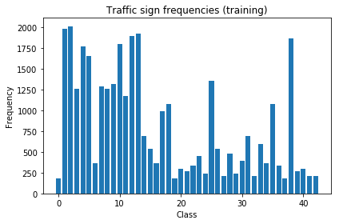
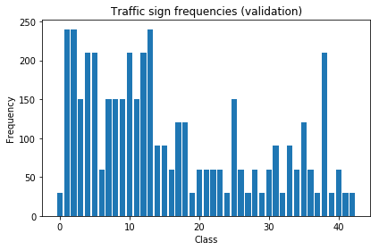
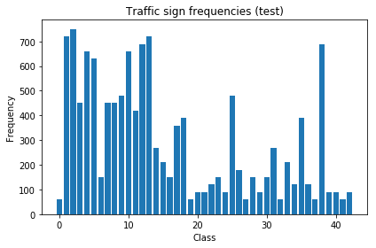
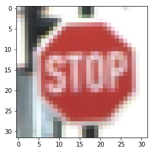
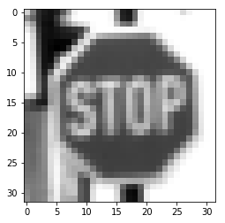
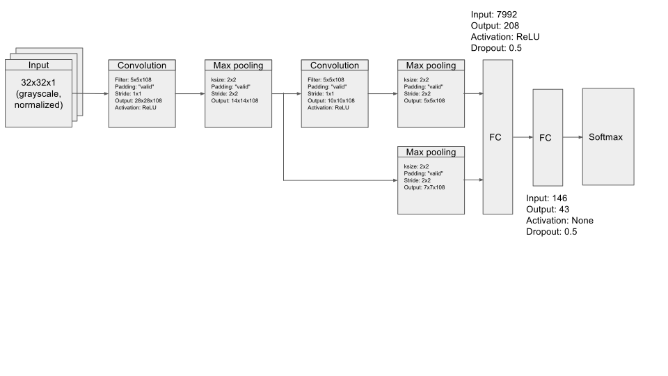
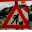
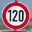

#Traffic Sign Recognition Project 

The goals / steps of this project are the following:
* Load the data set (see below for links to the project data set)
* Explore, summarize and visualize the data set
* Design, train and test a model architecture
* Use the model to make predictions on new images
* Analyze the softmax probabilities of the new images
* Summarize the results with a written report

[//]: # (Image References)

[image1]: ./examples/visualization.jpg "Visualization"
[image2]: ./examples/grayscale.jpg "Grayscaling"
[image3]: ./examples/random_noise.jpg "Random Noise"
[image4]: ./examples/placeholder.png "Traffic Sign 1"
[image5]: ./examples/placeholder.png "Traffic Sign 2"
[image6]: ./examples/placeholder.png "Traffic Sign 3"
[image7]: ./examples/placeholder.png "Traffic Sign 4"
[image8]: ./examples/placeholder.png "Traffic Sign 5"

## Rubric Points
Here I will consider the [rubric points](https://review.udacity.com/#!/rubrics/481/view) individually and describe how I addressed each point in my implementation.  

---

###Data Set Summary & Exploration

####1. Basic summary of the data set.

* The size of training set is: 34799 samples.
* The size of the validation set is: 4410 samples.
* The size of test set is: 12630 samples.
* The shape of a traffic sign image is: (32, 32) pixels.
* The number of unique classes/labels in the data set is: 43.

Note: You can run the accompanying Jupyter notebook to look at the current figures. 

####2. Exploratory visualization of the dataset.

Here is an exploratory visualization of the data set. It is a bar chart showing how the input data is distributed across classes. As you can see there is considerable variation in the number of examples available for any given traffic sign class.

##### Frequency v/s class plots

###Design and Test a Model Architecture

####1. Preprocessing

A little massaging of the input data helps the neural network perform much better by ironing out insignificant details. Here are the preprocessing steps I used for the project...

1. Convert the images to grayscale. This reduces the complexity of the input image by getting rid of color information. Color is not strictly necessary for recognizing traffic signs. It helps reduce the [cognitive load](https://en.wikipedia.org/wiki/Cognitive_load) on the neural network (loosely speaking).

Here is an example of a traffic sign image before grayscaling...

Post grayscaling and normalization...

2. Normalize data into a [-0.5, +0.5] interval. This plays well with the initial value of the weights used in the network. This step does not actually change the appearance of the image but does make the model converge on the solution early.

####2. Final model architecture

My final model consists of ...

1. A convolutional neural network as the first stage. This CNN has a 5x5x108 filter and it processes the input image one 5x5 tile at a time while sliding it 1 step in each direction and uses "valid" padding at the edges. The 108 filters can potentially recognize upto 108 (5x5) features in the input image. Each filter is terminated by a ReLU activation function. The output size for this stage is 28x28x108.

2. The output from the previous stage is downsampled by a "max pooling" layer with a kernel size of 2x2 and stride of 2x2. This effectively halves the vertical and horizontal dimensions of the output generated by the previous stage. This helps iron out any marginal jitter in the input image while reducing the processing load for the next stage. The output size for this stage is 14x14x108.

3. The next stage is another convolutional neural network. This unit is identical to the CNN described in point 1 except for the input and output sizes. The output size for this stage is 10x10x108.

4. The output from the previous stage is downsampled by a "max pooling" layer with a kernel size of 2x2 and stride of 2x2. The output size for this stage is 5x5x108.

5. The output from the max pooling stage in point 2 is passed on to another downsampling stage to get an output of size 7x7x108 directly from the first CNN.

6. Outputs from stages 4 and 5 are flattened and passed on to a fully connected layer of neurons with input size 7792 and output size 208, with ReLU activation and a dropout rate of 0.5.

7. Output from the previous stage is passed on another fully connected layer. This time with input size: 146 and output size: 43 which is equal to the number of classes recognised by this classifier. This layer does not use any special activation function (but perhaps the succeeding stage can be considered as an activation function for this layer). It just outputs the linear combination of its inputs. The output generated by this layer is sometimes also known as logits (short for logistical bits?)

8. The final layer is a softmax function which converts the logits into a probability distribution for further use.

####3. How the model was trained

I trained my model using the tensorflow Adam optimizer. It uses moving averages of the parameters (momentum). This enables Adam to use a larger effective step size, and the algorithm will converge to this step size without fine tuning.

The following hyper parameter values worked best for me...
- Batch size: 256
- Learning rate: 0.001
- Epochs: 1 to 100
- For intial weight values
    - $\mu=0$
    - $\sigma=0.09$

The training was run in batches of 256 images until the training accuracy was >= 0.9999. Since designing a model with just the right size ahead of time is a difficult task an oversized model was chosen. There was a risk of overfitting the model to the data because of the larger model size so training was stopped once we reached accuracy >= 0.9999. Also any further training might have caused the validation set to leak into the model even more without significantly improving real world accuracy.

####4. Final result

* Training set accuracy:     0.9999
* Validation set accuracy:   0.9800
* Test set accuracy:         0.9618

####5. Approach taken for improving training accuracy (over LeNet)

I decided to adapt the [LeNet](http://yann.lecun.com/exdb/lenet/) architecture for this project. LeNet was used as a recognizer for the MNIST data set (set of digits from 0 to 9) and has proved to be quite effective. I also took some inspiration from the [Traffic Sign Recognition with Multi-Scale Convolutional Networks](http://yann.lecun.com/exdb/publis/pdf/sermanet-ijcnn-11.pdf) paper by Pierre Sermanet and Yann LeCun.

To improve the accuracy over a basic LeNet implementation...

- The input was converted into grayscale and normalized into a [-0.5, 0.5] range.
- The feature size of the CNNs was increased to 108 to deal with the increased complexity of the input.
- Ouput from the first CNN was connected to the first fully connected layer used as part of the classification mechanism (after some additional max pooling). In practise it is observed that the layers closer to the input learn to recognise smaller features such as lines and traces while the subsequent layers pool these smaller features together to recognize larger features. Connecting the first CNN along with output from the second CNN to the first FC layer allowed the classifier to make better decisions where it could take into consideration both small and large features of the input images (if required).
- Adding drop out layers to the classifiers improved the convergence rate and final accuracy significantly. A drop out value of 0.5 was found to perform best experimentally, anything lower than this degraded accuracy severely, anything higher was not as bad but was still sub-optimal (in terms of convergence rate). The drop out should have also helped regularize the network (prevent over fitting).

###Test a Model on New Images

####1. Some new German traffic signs (derived from resources on the web)

      

####2. Model's predictions on the traffic signs taken from the web

The final model was able to classify all the new signs correctly except for: . It was classified as a 'Speed limit (100km/h)' sign instead of a Stop sign.

It appears this sign is too small for the recognizer (because it was able to recognize the same image with better zoom: )

The model was able to correctly guess 6 of the 7 new traffic signs, which gives it an accuracy of about 86%. The accuracy is 100% for normal size signs.

The test set accuracy is at 96% which probably means it does not have any small stop signs! The model can perhaps be made to work with smaller signs by scaling the training set into smaller images and using this to retrain the model. The same principle can perhaps be used to make the model more rubust with respect to changes in orientation, lighting etc.

####3. Softmax probabilities

The code for making predictions on my final model is located in the 34th cell of the Jupyter notebook.

Here are the probabilities assigned by the model for each image taken from the web...

1.  Stop sign. Predictions...
    1) 100.00%:	Stop (=14)
    2) 0.00%:	Keep right (=38)
    3) 0.00%:	Speed limit (20km/h) (=0)
    4) 0.00%:	Yield (=13)
    5) 0.00%:	Turn left ahead (=34)

2.  Speed limit (120km/h). Predictions...
    1) 86.04%:	Speed limit (120km/h) (=8)
    2) 8.39%:	Speed limit (20km/h) (=0)
    3) 4.14%:	Speed limit (60km/h) (=3)
    4) 1.34%:	Speed limit (70km/h) (=4)
    5) 0.08%:	Vehicles over 3.5 metric tons prohibited (=16)
    
3.  Stop sign (small). Predictions...
    1) 47.52%:	Speed limit (100km/h) (=7)
    2) 24.69%:	Vehicles over 3.5 metric tons prohibited (=16)
    3) 17.30%:	Roundabout mandatory (=40)
    4) 7.58%:	Right-of-way at the next intersection (=11)
    5) 0.63%:	Dangerous curve to the left (=19)
    
4.  Priority road. Predictions...
    1) 100.00%:	Priority road (=12)
    2) 0.00%:	Yield (=13)
    3) 0.00%:	Roundabout mandatory (=40)
    4) 0.00%:	End of no passing (=41)
    5) 0.00%:	No entry (=17)
    
5.  Road work. Predictions...
    1) 100.00%:	Road work (=25)
    2) 0.00%:	Double curve (=21)
    3) 0.00%:	Road narrows on the right (=24)
    4) 0.00%:	Beware of ice/snow (=30)
    5) 0.00%:	Right-of-way at the next intersection (=11)
    
6.  Right-of-way at the next intersection. Predictions...
    1) 100.00%:	Right-of-way at the next intersection (=11)
    2) 0.00%:	General caution (=18)
    3) 0.00%:	Pedestrians (=27)
    4) 0.00%:	Roundabout mandatory (=40)
    5) 0.00%:	Priority road (=12)
    
7.  Turn right ahead. Predictions...
    1) 100.00%:	Turn right ahead (=33)
    2) 0.00%:	Ahead only (=35)
    3) 0.00%:	Speed limit (70km/h) (=4)
    4) 0.00%:	Road narrows on the right (=24)
    5) 0.00%:	Speed limit (20km/h) (=0)
